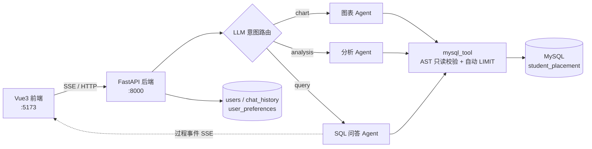

# 小智 · 基于 RAG 多智能体的高校就业收入智能分析平台

> 一个基于 **FastAPI + LangGraph + Vue3** 的自然语言数据分析智能体：用大白话提问，
> Agent 自动生成 SQL 查询 MySQL，返回 **文字结论 + 结构化分析 + ECharts 图表**，
> 并**实时展示 Agent 的思考过程**（🔧 正在查询数据库 → ✅ 整理结果 → 逐字回答）。


---

## ✨ 核心特性

- 🔐 邮箱验证码登录（QQ 邮箱 SMTP）
- 🗣️ **自然语言 → SQL（Text-to-SQL）**：不懂 SQL 也能问业务问题
- 📊 自动生成 **ECharts 图表**（柱状图 / 折线图 / 饼图…）
- 🧠 **结构化分析**：一次返回「结论 + 详细分析 + 关键发现 + 图表」
- 👀 **Agent 过程可观测**：实时推送「正在查询数据库…」等中间步骤
- 💬 多轮会话记忆 + 聊天记录持久化
- 📁 CSV / Excel 数据上传导入（宽容的列名映射）
- 🎛️ 用户偏好（回答详细程度 simple/normal/detailed）

---

## 🏗️ 技术架构



**技术栈**

| 模块 | 技术 |
|---|---|
| 后端 | FastAPI、Uvicorn |
| Agent 编排 | LangGraph（ReAct Agent + Tool Calling）、LangChain |
| 大模型 | OpenAI 兼容接口（DeepSeek / DashScope 等） |
| 数据库 | MySQL 8.0（PyMySQL） |
| 数据导入 | pandas |
| 前端 | Vue3 + Vite + ECharts + marked |
| 登录 | 邮箱验证码（SMTP）+ 后端内存缓存 |

---

## 🚀 技术亮点

1. **LLM 意图路由**：用大模型把问题分类为 `chart / analysis / query`，替代脆弱的关键词匹配，路由更准、更易维护。
2. **健壮的 Text-to-SQL 管道**：`sqlparse` 做 **AST 级只读校验**（仅允许单条 SELECT）、自动补 `LIMIT`、查询超时、错误回传让模型**自我纠错重试**；`schema` 抽成公共模块。
3. **Agent 执行过程可观测**：基于 `astream_events` + **SSE** 实时推送工具调用中间步骤到前端。
4. **LLM 输出 JSON 多层容错**：直接解析 → 剥 markdown → 正则提取 → `json_repair` 修复 → 规则兜底，保证前端解析成功率。
5. **统一的 SSE 响应架构**：后端所有分支统一返回 SSE 流，前端不再重复判断意图，消除「路由不一致导致的请求悬挂」。

---

## 📊 效果评估

自建 Text-to-SQL 评估集（`tests/eval_text2sql.py`），覆盖学历 / 专业 / 州 / 行业等维度：

```
Text-to-SQL 准确率: 6/6 = 100.0%
```

---

## 📁 目录结构

```text
rag-agent-student-employment/
├── agent/                    # 意图路由 / SQL问答 / 图表 / 分析 / 登录 智能体
│   ├── intent_router.py      # LLM 意图分类
│   ├── schema_info.py        # 公共数据库表结构说明
│   ├── sql_question_agent_pg.py
│   ├── echarts_agent.py
│   ├── anlyze_agent.py
│   └── system_agent.py
├── chat/                     # 聊天接口（SSE）+ JSON 容错
├── system/                   # 登录、验证码接口
├── model/                    # 大模型封装（单例、流式开关）
├── tool/                     # mysql_tool（只读）、send_email（含 DEV 开关）
├── schema/                   # Pydantic 参数模型
├── utils/                    # 日志、文件导入
├── tests/                    # Text-to-SQL 评估脚本
├── frontend/                 # Vue3 前端
├── data/                     # 数据目录（大数据文件不入库）
├── scripts/                  # PowerShell 一键脚本
├── init_db.py                # 建库建表
├── import_data.py            # 导入 PSEO 数据
├── main.py                   # 后端入口
└── requirements.txt
```

---

## ⚡ 快速开始

**依赖**：Python 3.10+、Node.js 18+、MySQL 8.0

```powershell
# 1. 配置环境变量
copy .env.example .env
#   编辑 .env：填 OPENAI_API_KEY、MYSQL_PASSWORD、EMAIL_USER / EMAIL_PASSWORD

# 2. 创建并激活虚拟环境
py -m venv .venv
.\.venv\Scripts\Activate.ps1

# 3. 安装依赖
pip install -r requirements.txt

# 4. 建库建表 + 导入数据
python init_db.py
python import_data.py

# 5. 启动后端（http://localhost:8000）
python main.py
```

```powershell
# 6. 启动前端（http://localhost:5173）
cd frontend
npm install
npm run dev
```

> 📌 **本仓库不包含大数据集文件**（约 11 MB），请将 PSEO 的 CSV/Excel 放入 `data/`
> （如 `data/pseo_outcomes.csv`），并在 `.env` 配置 `DATA_FILE_PATH`，再执行第 4 步。
>
> 💡 想本地调试验证码（不真发邮件），在 `.env` 设置 `EMAIL_DEV_MODE=true`。

---

## 💡 可提问示例

- 统计不同学历层级的就业率
- 哪些专业毕业后 1 年收入中位数最高
- 画一个不同学历层级的就业率柱状图
- 用柱状图分析不同专业的收入中位数

---

## 📌 数据说明

数据为美国 **PSEO（Post-Secondary Employment Outcomes）** 高校就业与收入公开数据，
字段覆盖学历层级、专业、学校、州、行业、就业率、毕业 1/5/10 年收入中位数与分位数。
导入脚本内置常见列名映射、类型转换、缺失字段推导与异常值过滤。